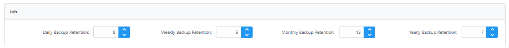

*NOTE* that Skyve backup and restore is an application wide function - across all customer data segments. If your application is a multi-tenant SaaS application, you should consider carefully both backup and restore options.

## Taking a backup

To take a backup, the user must have the *DevOps* role in the admin module.

To take the backup:

1. Login with a user which has the `DevOps` role
1. Navigate to the Admin module, and select the *Data Maintenance* menu item
1. Switch to the *Backup/Restore* tab
1. Press the *Backup* button (bottom RHS of the view) 
1. Once the backup is complete, refresh the *Backups* list to check it is complete (it may take some time) - note that the backup process is run as a Skyve *Job* and the progress and completion of the backup can be reviewed from the admin *Jobs* menu
1. If you wish to download the backup, select the backup from the list and press *Download Backup*

### Backup options
Before making a backup, there are options found next to the *Backup* button, highlighted below:

- **Content** - Check this to include content in the backup that is made
- **Audit Log** - Check this to include the audit log that are made by the system into the backup created.
- **Sensitivity** - While making a backup, skyve has the ability to redact certain data for security purposes. The drop-down is used to select the sensitivity level to be used during redaction. Attributes with security level that is greater than or equal to the security level selected are redacted. Below are the security levels available in ascending order in terms of sensitivity:
		- **None**
		- **Internal** 
		- **Confidential**
		- **Restricted**
		- **Personal**
		- **Secret**

## Scheduling regular backups

Skyve has the capability of running a regular backup schedule, however this is not enabled by default.

To schedule backups the user must have the *JobMaintainer* role in the admin module.

To schedule the backup job:

1. Login with a user which has the `JobMaintainer` role
1. Navigate to the Admin module, and select the *Jobs* menu item
1. Switch to the *Schedule* tab
1. Click the `+` symbol to create a new schedule
1. Select *admin - Scheduled Backup all data and content* as the *Job To Run*
1. Select the appropriate user as the *Run As* user
1. Select the required frequency by specifying the minutes, hours, days, months and/or weekdays and a date range (if required)
1. Click `Save` to save your schedule, or press `OK` to save and return to the schedule list.

An example configuration is shown for daily backups.

## Cyclic retention settings

The Skyve platform includes cyclic retention settings to allow you to control how many backups are kept as part of the regular schedule.

To access the cyclic retention settings:

1. Login with a user which has the `DevOps` role
1. Navigate to the Admin module, and select the *Data Maintenance* menu item
1. Switch to the *Backup/Restore* tab
1. Set the cyclic retention settings (shown below) as required.
1. Press `Save` to save your settings

## Restoring a Skyve backup

Skyve offers a number of *Pre-Process* options to handle cases where the application domain model may have progressed since the backup was taken - this situation is not typically handled by other platforms. 

*NOTE We recommend performing a backup immediately prior to a restore to ensure you can recover if the restore fails.*

To restore a Skyve backup:

1. Login with a user which has the `DevOps` role
1. Navigate to the Admin module, and select the *Data Maintenance* menu item
1. Switch to the *Backup/Restore* tab
    1. If restoring from an application which may have a different version of the application, we recommend performing a backup immediately prior to a restore to ensure you can recover if the restore fails.
1. If you are restoring a backup from another instance or system, press *Upload Backup* to upload the backup zip file (alternatively, place the zip into the backup area - inside the application *content* folder)
1. Refresh the backup list to check the upload was successful
1. Select the uploaded backup in the list
1. Select the appropriate *Content Option*, *Indexing Option* and *Pre-Process* (all explained below)
1. Press the *Restore* button (bottom RHS of the view) 
1. The restore process is run as a Skyve *Job* and the progress and completion of the restore can be reviewed from the admin *Jobs* menu

*WARNING*: Wait until the *Restore* process completes before taking any other actions. While the *Restore* process is in progress, data entry or other application activities may lead to unexpected results.

If the *Restore* fails - it is likely that previous user credentials will have been deleted by the restore and you may need to recover. 

1. Review the *Pre-Process* method and check whether you have selected the correct option. 
2. Check if user data has been deleted, and if so, create a user with *DevOps* role before logging out.
3. If you missed step 2 and you need to recover and can't log in, do the following:
    1. delete the application database and recreate an empty database to match the settings in your `datasource.xml`
    2. change the `environment` setting in the application `.json` file to a non-null value - e.g. `"recovery"`
    3. set a bootstrap user in the application `.json` file
    4. restart the wildfly service or redeploy the application 
    5. log in and resolve the restore or restore the backup you took in step 4.i. above
    6. once the situation is resolved, revert the `environment` and `bootstrap` settings in the application `.json` file
    7. restart the wildfly service or redeploy the application

### Content Option

The *Content Option* allows control over whether content items which may have been orphaned in the backup are restored.

Skyve stores the ID of "attachments" or content items in the `content` type attribute.

Consider the situation where developers have modified the application since the backup was taken, and `content` type attributes may have been deprecated resulting in the associated content items becoming *orphaned* (or disconnected). 

In this situation, the options provide are as follows:

Option | Description
-------|-----------
*Clear Orphaned Content IDs* | With this option selected, the restore will clear any orphaned content IDs leaving the associated `content` type attributes `null`. 
*Save Orphaned Content IDs* | With this option selected, the restore will preserve orphaned content IDs, which may be useful if an attempt will alter be made to reunite content items with the structure data store.
*Error* | (*Recommended*) With this options set, if orphaned content items are discovered during the restore, the restore will fail (error) and roll-back. 

The recommended setting is *Error*.

If this option is set and a *Domain Exception* occurs during restore (check the restore Job log via the admin *Jobs* menu), it may be that the backup was taken from an instance with orphaned content Ids.

In this case we recommend the resolving the data issues in the original system (where the backup was taken from), and take another backup - then restore this backup.

Alternatively, change the option to *Clear Orphaned Content IDs* and restore the backup.

### Indexing Option

Skyve maintains an index to long text items and content items in a consolidated index that supports federated (i.e system-wide) searching (See [Content Search](./../_pages/content-search.md))

While indexing is not critical to the restore process, content searching will be invalid after a restore until the indexing process is completed.

If the backup being restored is large, or the restore process is taking a large amount of time for other reasons, you may wish to decide to complete only a partial indexing or none (and perform the index at a later time).

Option | Description
-------|-----------
Data | Index only the sql/structure/relational data during the restore.
Content | Index only content/non-sql/non-structured data during the restore.
Both | (*Recommended*) Index both data items flagged for indexing *and* content items during the restore.
None | Use this option if you intend to perform indexing at another time.

The recommended setting is *Both*.

To perform indexing after the restore is complete, use the *Reindex* action on the *Content* tab.

### Restore Pre-Process

For most situations, we recommended using the setting *Delete existing table data using metadata*.

However, to handle situations where there is a mismatch between the domain/schema of the backup and the system being restored, Skyve provides a number of *Pre-Process* options.

To provide more options for recovery and resolving of schema mismatches, the Skyve backup format includes sql scripts to create (create.sql) and delete tables (delete.sql) for the schema of the backup. 

Some options are only available for single-tenant applications - that is, where only one customer is declared.

Option | Availability | Description 
-------|--------------|-------------
*None* | All | Use this option when you've created your database from scratch (or with the bootstrap) and Skyve has created all database objects. You know the backup is from the same version and the schema is synchronised (matches the metadata). 
*Drop tables using metadata & recreate tables from backup create.sql* | Single tenant | Use this option when your backup is from a different version of the application, you want the schema to be dropped (the schema matches the metadata) using the system metadata deployed, but you need the schema to look like it did when the backup was taken. (Part of the restore post-process is to sync the schema and reindex content.)
*Drop tables using backup drop.sql & recreate tables from backup create.sql* | Single tenant | Use this option when your schema matches the application version of the backup (maybe your previous attempt to restore failed). You can't drop the schema without stopping the server and if you do that, you can't log in any more without restoring. Since the backup/restore only looks after tables under Skyve control, it could be that extra tables have constraints that you need to drop or other issues that you only find after trying to restore.
*Drop tables using metadata & recreate tables from metadata* | Single tenant | Use this option when you know the backup is from the same version of the application. You have a large amount of data that you want to delete and the quickest way is drop and recreate the schema.
*Drop tables using backup drop.sql & recreate tables from metadata* | Single tenant | Use this option when you've tried a restore before and your database is now in the shape of the backup application version.
*Create tables from backup* | Single tenant | Use this option when you've created a empty schema (manually or scripted).
*Create tables from metadata* | Single tenant | Use this option when you have a empty schema but the backup application version doesn't match your version.
*Delete existing table data using metadata* | All | Use this option when the backup is from the same version of the application and your data size is not large (i.e. just delete the data and then run the restore.)

Note that not all schema differences can be handled automatically - we recommend testing that you can restore backups from previous versions regularly if you are in transition or ongoing development.

The recommended setting is *Delete existing table data using metadata*.