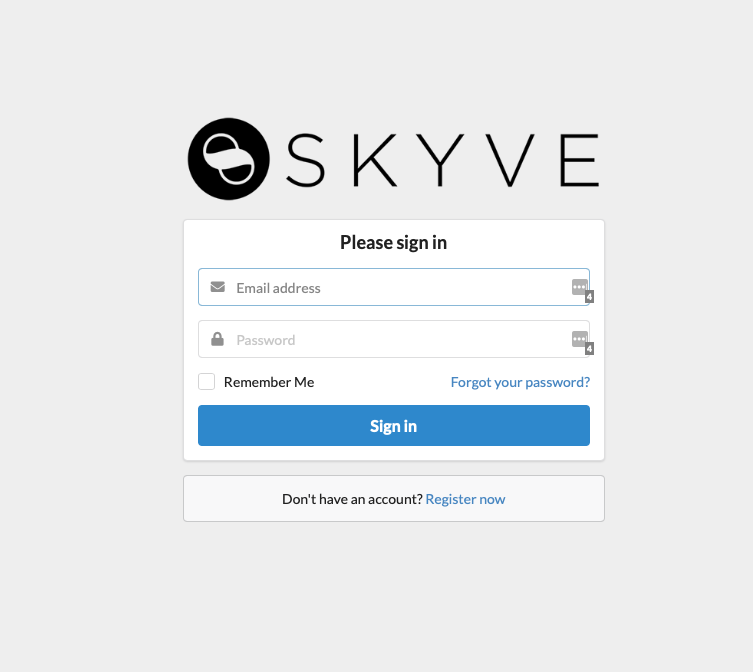

By default Users are added manually by a system administrator to Skyve applications. Self-registration can be enabled by an administrator to allow new users to register by themselves. Once self-registration is enabled for your application, a Register link will be added to the login page.

## Pre-Requisites

To enable self-registration, the following pre-requisites need to be met for your application:

1. needs to have a “public” user created in the system, this is used for application permissions during the registration process. Create a user with a random strong password and the “Admin - Anonymous” role
1. needs to have Email configured, so that account activation emails can be sent, and users can reset their own passwords
1. needs to have a Self-Registration group created, this defines the default permissions new users get in the system after registration
1. must be a single-tenant application, i.e. a default customer is set in the application json file under environment : customer

## Enable Self-Registration

To enable self-registration:

1. from the Startup screen of your new application, or the Startup Configuration tab from Security Admin -> Configuration, tick “Allow User Self Registration”
1. configure your Mail Settings and make sure Test Mode and Test Mail Recipient are not set and click Save
1. from the General tab of Security Admin -> Configuration, select the “User Self Registration Group” and set the “Anonymous Public User” and click Save
1. If everything is set up correctly, your login page should now switch to email address as the username field, and show a link to Register below the login form.
## Managing self-registered accounts

Registered users activate their own account via the link in their activation email. If a user does not receive the email or their link has expired, an administrator can resend the activation email or activate the account manually from the user's record — see [Activating a self-registered user]({{ site.url }}{{ site.baseurl }}/users/#activating-a-self-registered-user).

## What the user sees

Once self-registration is enabled, the sign in page shows a *Register* link below the login form. The registration form asks for the user's name, email address (entered twice to confirm), and a password (also confirmed). If a CAPTCHA has been configured in the [security settings]({{ site.url }}{{ site.baseurl }}/configuration/#security-settings), the user must complete it before registering.

After clicking *Register*, the user is told to check their email (including their spam folder) for an activation link. Clicking the link activates their account, and they can then sign in. If the link has expired or the account is already activated, the activation page says so — an administrator can [resend the activation email]({{ site.url }}{{ site.baseurl }}/users/#activating-a-self-registered-user) if needed.

## Troubleshooting

The application surfaces warnings when self-registration is not fully configured:

- *"Self-registration has been enabled - please ensure that email is configured and a self-registration group is chosen"* — shown on the Configuration page until both prerequisites are in place.
- The *Allow User Self Registration* checkbox is greyed out for multi-tenant applications — self-registration requires a single-tenant application.
- Registration emails will not send if mail settings are missing, or if *Test Mode* is enabled or a *Test Mail Recipient* is set (which redirect all email).
