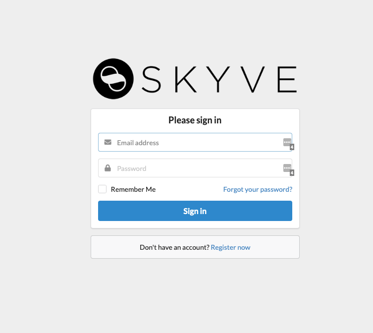

By default Users are added manually by a system administrator to Skyve applications. Self-registration can be enabled by an administrator to allow new users to register by themselves. Once self-registration is enabled for your application, a Register link will be added to the login page.

## Pre-Requisites

To enable self-registration, the following pre-requisites need to be met for your application:

1. needs to have a “public” user created in the system, this is used for application permissions during the registration process. Create a user with a random strong password and the “Admin - Anonymous” role
1. needs to have Email configured, so that account activation emails can be sent, and users can reset their own passwords
1. needs to have a Self-Registration group created, this defines the default permissions new users get in the system after registration
1. must be a single-tenant application, i.e. a default customer is set in the application json file under environment : customer

## Enable Self-Registration

To enable self-registration:

1. from the Startup screen of your new application, or the Startup tab from Security Admin -> Configuration, tick “Allow User Self Registration”
1. configure your Mail Settings and make sure Test Mode and Test Mail Recipient are not set and click Save
1. from the General tab of Security Admin -> Configuration, select the “User Self Registration Group” and set the “Anonymous Public User” and click Save
1. If everything is set up correctly, your login page should now switch to email address as the username field, and show a link to Register below the login form.