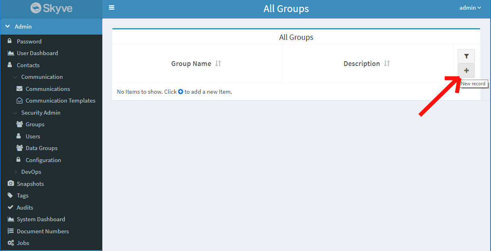
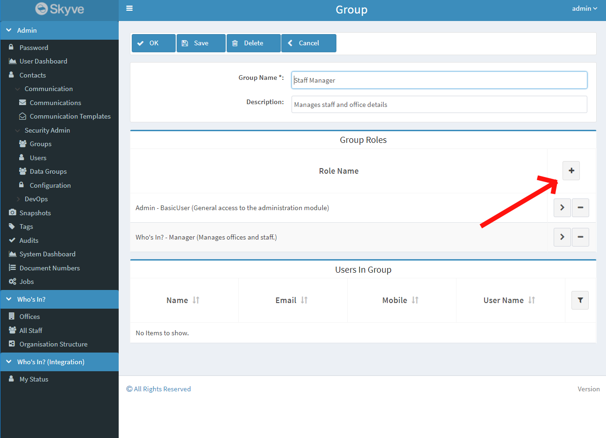
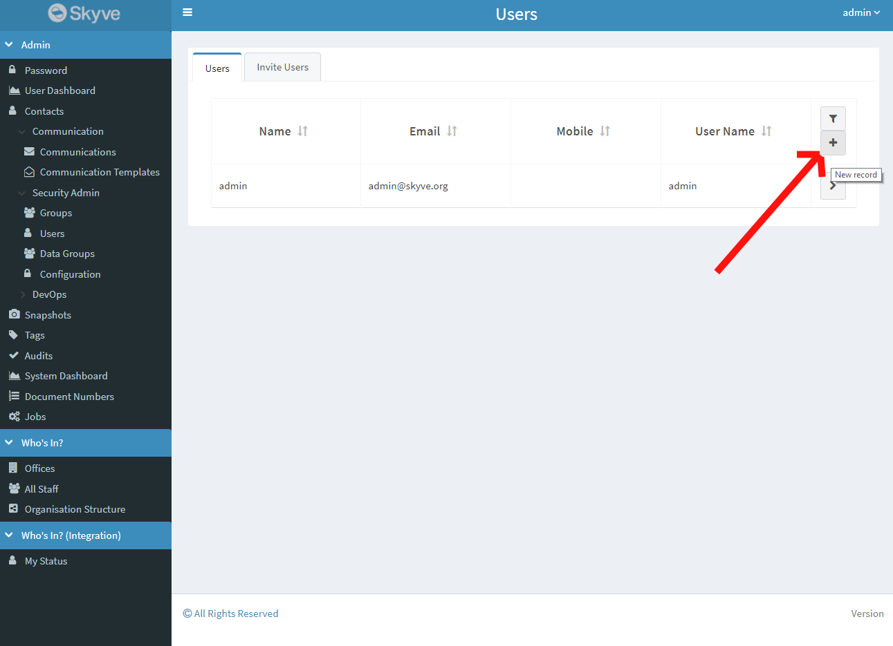
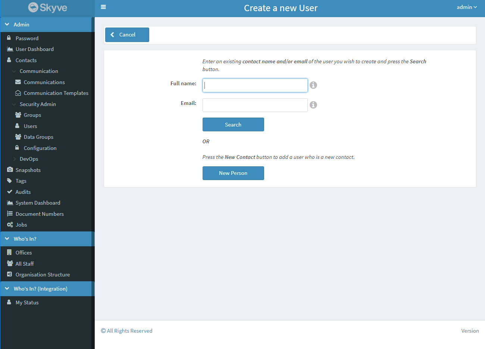
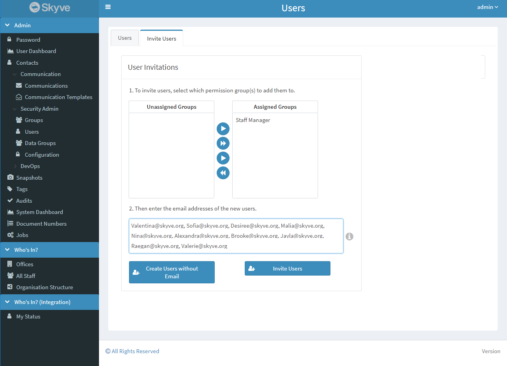

## User Management

User management within Skyve applications is accessed from the Admin -> Security Admin -> Users menu. This allows new users to be added, existing users to be marked inactive or deleted, and user permissions to be updated.

### Security Implementation

In Skyve, security is implemented within Roles and Groups. Groups are used to combine roles into a defined collection of permissions which is useful for structuring Roles for multiple Users. Roles on the other hand allow for more control over an individual User's Roles within an application.

Users can have multiple groups assigned to them which cover their Roles to use the application, additional Roles can then be added to that User if it doesn't make sense to define a new Group.

### Security groups

A group is a combination of module-specific roles typically combined to represent a user access profile related to a business access profile.

Typically (not always) users will require a combination of roles to be able to access Skyve applications, for example, a back-end (staff) user may require:
- basic user privileges to the admin module to be able to manage their own user account, change password and contact details and view contact details of other back end users
- a role declared in the module(s) for your custom application.

The roles configured by default for the Skyve admin module are as follows:

Role | Explanation | Description
---|---|---
*Anonymous* |  | Access anonymous (not logged in) public features
*AppUser* | The App User role is intended for retail and public users interacting through the "front office". These users are assumed to operate within their own scope and have only visibility to their own data. App Users can create their own contacts, and change their own passwords. | Manage own contact details and password
*AuditManager* |  | Manage the activity audit log
*BasicUser* | The intention of Basic User role is to provide basic capability to back-office users. The role is for a typical office situation where users collaborate within the "Customer" scope on key application areas. For example, shared contact management, common document number serials and the ability to use Skyve's basic personal efficiency and automation capabilities, Tags, Snapshots, Communication and view dashboards. | General access to the administration module
*ContactManager* | Allows atomic control over management of, and interaction with, contacts. | Manage contact details and interactions
*ContactViewer* | Allows atomic control over visibility of contacts. | View-only access to contact details
*DevOps* | | Generate Skyve designs and metadata and administer technical aspects of the Skyve runtime
*JobMaintainer* | Allows atomic control over the ability to schedule jobs and review job progress. | Maintain Jobs
*SecurityAdministrator* | Administration of users and permissions. | Allows administration of Users and Groups
*ViewUser* | The view user is intended as a read-only office user, with visibility as per Basic User role. | View-only access to the administration module

Groups can be further combined on a per user basis and user creation provides for selection of groups.

Groups can also be combined for customer-specific combinations, however these combinations are set at design-time by the developer. For more information see the <a href="https://skyvers.github.io/skyve-dev-guide/customers/#customer-groups">developer guide</a>. 

### Adding a new group

1. Login with a user which has the `SecurityAdministrator` role
2. Navigate to the Admin module, and select _Groups_ under Security Admin
3. From the user list, click the `+` button to open the new user view

4. Add the desired combination of roles to the group by clicking the `+` button above the _Roles_ collection

### Adding a new User

_Prerequisites:_ You have at least one group created for user permissions (see above).

1. Login with a user which has the `SecurityAdministrator` role
2. Navigate to the Admin module, and select _Users_ under Security Admin
3. From the user list, click the `+` button to open the new user view

4. Click *New Person* 
    1. (alternatively, you can enter a name or email address of an existing Contact in the system and click Search to create a User for a Contact)
6. Enter the full name and email address of the new user and click *Next*

7. Change the generated username if required
8. Enter a matching password and confirm password, then click *Next*
9. Select the groups the new user will be added to by selecting it from the Unassigned list then clicking the right arrow (`>`)
10. Click _OK_ to save the user

### Inviting new users and bulk user creation

To have the system send an invitation email to one or multiple new users, you can use the invitation feature. Invited users will receive an email with a link to the application, allowing them to choose their own password on first login.

_Prerequisites:_ 

* Your application has its SMPT settings configured to enable sending email
* You have at least one group created for user permissions (see above)

1. Login with a user which has the `SecurityAdministrator` role
2. Navigate to the Admin module, and select `Users` under Security Admin
3. Select the _Invite Users_ tab
4. From the list of Groups, assign any group permissions new users will have after they are invited by selecting the group(s) and clicking the right arrow (`>`)
5. Enter a comma or semicolon separated list of email addresses to be sent invitations into the text area below

If you have email configured:
- press the button to invite users.

This will initiate a Skyve Job (reviewable from the Admin->Jobs menu) to create each new user record and send each user a *password reset token*.

If you have not yet configured email:
- use the *Create users without email* button and advise the users another way. 

This will initiate a Skyve Job to create the new user records, but without the email. When users access the Skyve application log in page, they can take advantage of the *password reset* function without a *password reset token*.

### Adding a Group or Role to a User

_Prerequisites:_ You have at least one user you wish to add permissions to

1. Login with a user which has the `SecurityAdministrator` role
2. Navigate to the Admin module, and select _Users_ under Security Admin
3. Zoom into the user you wish to add a Group or Role to
4.
    1. If you wish to add a Group to a user, navigate to the `Groups` tab, click the group you wish to add and click the `>` button to add it to the Assigned collection
    2. If you wish to add a Role to a user, navigate to the `Roles` tab, click the `+` button in the `User Roles` table, select the role you wish to add to the user, then click 'Zoom Out'

_Note: after changing permissions for a User, that user will need to log out and then log back in to apply the new permissions if they are already logged in._
